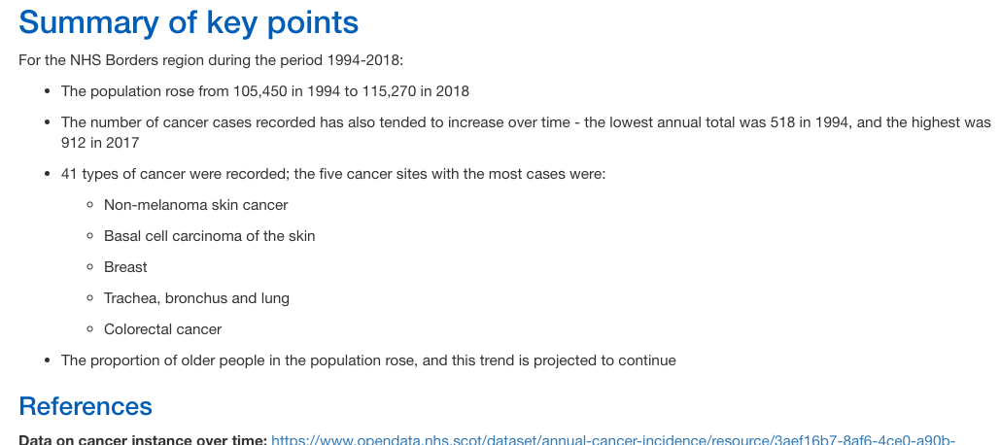

# Data investigation and report-writing project

## Overview

This project uses publicly available data to give a high-level insight into the incidence of cancer in the NHS Borders area.

## Process Methodology

I imported csv data files available at  *www.opendata.nhs.scot* and *www.nrscotland.gov.uk* into an R Studio project, and created an R script to clean and join them. I also did some research on general population trands in the area, and on the *age-standardised* incidence rates available in the report.

The cleaning file is saved as **data_cleaning.R** in the **scripts** folder:

After investigating the data, I created a markdown file containing my key findings - the brief was for:

* A report to help the recipient gain better understanding of the incidence of cancer in the NHS Borders area

* The report to be 1-2 pages long

* To give a 5 minute presentation on the report

## Packages Used

The main packages used for cleaning and analysis were **tidyverse** and **janitor**. I then produced data visualisations using  **ggplot**.

## Report Contents 

The R notebook **Report.rmd** in the **analysis** folder contains the code, analysis and data visualisations; I knitted this to HTML, and used this version, **Report.html**, for my presentation. 

The report looks at four  questions:

### References

**Data on cancer instance over time:** https://www.opendata.nhs.scot/dataset/annual-cancer-incidence/resource/3aef16b7-8af6-4ce0-a90b-8a29d6870014

**Population estimate data:** https://www.nrscotland.gov.uk/statistics-and-data/statistics/statistics-by-theme/population/population-estimates/mid-year-population-estimates/population-estimates-time-series-data

**Scottish Borders population trends:** https://www.nrscotland.gov.uk/files/statistics/council-area-data-sheets/scottish-borders-council-profile.html

**Definitions of crude and age-standardised rates:** https://ecis.jrc.ec.europa.eu/info/glossary.html

**Example of using age-standardised rates:** https://www.nrscotland.gov.uk/files//statistics/age-standardised-death-rates-esp/2017/age-standardised-17-methodology.pdf

**Health Board names reference data:** https://www.opendata.nhs.scot/dataset/9f942fdb-e59e-44f5-b534-d6e17229cc7b/resource/652ff726-e676-4a20-abda-435b98dd7bdc/download/geography_codes_and_labels_hb2014_01042019.csv